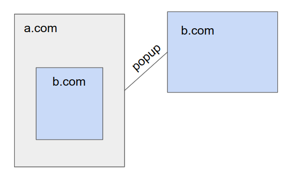
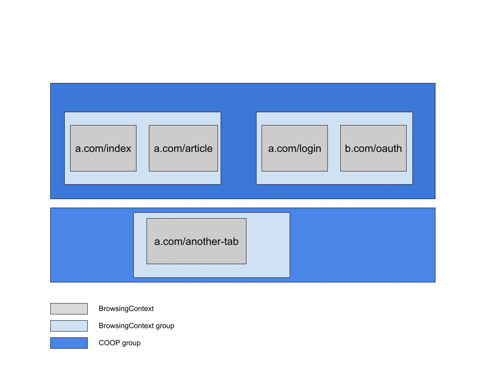
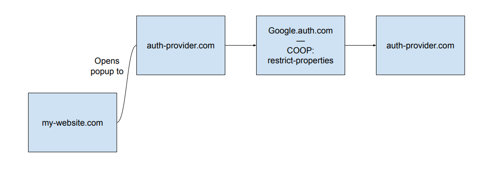
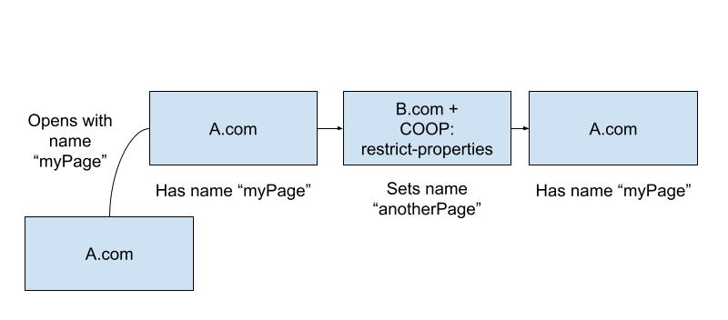

# Cross-Origin isolation with popups

This repository is dedicated to finding solutions to the cross-origin isolation with popups problem.

Currently for a document to be `crossOriginIsolated`, we need a `Cross-Origin-Opener-Policy: same-origin` header, and `Cross-Origin-Embedder-Policy: require-corp` or `credentialless` header. The `COOP` value prevents any interaction with cross-origin popups.

This proposal goal is to be able to enable `window.crossOriginIsolated` for pages that interact with cross-origin popups, both the opener and the openee. This would allow the use of APIs gated behind `crossOriginIsolated` such as `SharedArrayBuffer` or the Memory Measurement API to be used more widely. These flows are especially important because they are common. Oauth and payments are typical examples.

## Authors:
[Arthur Hemery](https://github.com/hemeryar)

## To Participate
https://github.com/whatwg/html/issues/6364

## Table of Contents

<!-- START doctoc generated TOC please keep comment here to allow auto update -->
<!-- DON'T EDIT THIS SECTION, INSTEAD RE-RUN doctoc TO UPDATE -->

- [Terminology](#terminology)
- [Why does crossOriginIsolated require COOP: same-origin](#why-does-crossoriginisolated-require-coop-same-origin)
- [The COOP: restrict-properties proposal](#the-coop-restrict-properties-proposal)
- [Fitting COOP: restrict-properties into current algorithm](#fitting-coop-restrict-properties-into-current-algorithm)
- [Typical use case & requirement](#typical-use-case--requirement)
- [Security considerations](#security-considerations)
  - [Same-origin policy](#same-origin-policy)
  - [Cross-origin subframes opening popup](#cross-origin-subframes-opening-popup)
  - [Window.name leakage](#windowname-leakage)
- [Extra notes on COOP: restrict-properties reporting](#extra-notes-on-coop-restrict-properties-reporting)
- [Stretch - COOP: restrict-properties as a default candidate](#stretch---coop-restrict-properties-as-a-default-candidate)
- [Stakeholder Feedback / Opposition](#stakeholder-feedback--opposition)
- [References & acknowledgements](#references--acknowledgements)

<!-- END doctoc generated TOC please keep comment here to allow auto update -->

## Terminology
In this explainer, we call _document_ what is rendered by any individual frame. A _page_ contains the top level document, as well as all of its iframe documents, if any. When you open a popup, you get a second page.

## Why does crossOriginIsolated require COOP: same-origin
Because of [Spectre](https://spectreattack.com/), OS processes are now the only strong security boundary. `crossOriginIsolated` makes Spectre easier to exploit via powerful APIs, so we need to be able to put `crossOriginIsolated` pages that in their own process. To be able to honor that, we used the spec concept of BrowsingContext groups.

A BrowsingContext belongs to a BrowsingContext group. All documents presented in a BrowsingContext can reach other documents presented in BrowsingContexts in the same BrowsingContext group via javascript. The BrowsingContext group holds a map of (roughly) origins to Agent Clusters. All documents in the same Agent Cluster are same-origin pages that can reach one another, and therefore have synchronous scripting access. They need to be in the same process.

Putting two documents in BrowsingContexts not belonging to the same BrowsingContext group makes sure they do not need to be in the same process. `Cross-Origin-Opener-Policy` leverages this mechanism to decide whether or not two pages can be in the same BrowsingContext group.

 

  
_The basic case COOP solves. Without COOP, we have to put all the documents in the same process, because the popup and the iframe are of origin b.com. They can synchronously script each other's DOM._

 

## The COOP: restrict-properties proposal
Instead of completely removing scripting capabilities between two pages, we would like to only restrict synchronous access, which is more precisely what requires pages to be in the same process. For this purpose, we introduce a new superset of BrowsingContext group, the COOP group (tentative name). Within this new group, pages have asynchronous access to each other. This gives us the following multi-layer structure.

 

_In this example, a.com/index and a.com/article have synchronous script access, but can only asynchronously access a.com/login and b.com/oauth. a.com/another-tab has no access to other a.com pages._

 

Putting pages in a different BrowsingContext group but same COOP BrowsingContext group would be done via a new `COOP` value, `restrict-properties` that would only allow access to asynchronous properties. This makes it possible to put the two pages in different processes, and to enable `crossOriginIsolated` on the first page, as long as it also sets `COEP`.

To reduce XS-leaks as much as possible, we reduce asynchronous across-BrowsingContext groups to a very limited set of properties: {`window.closed` and `window.postMessage()`}. This is based on metrics research that shows that the overwhelming majority of sites only uses these two properties when interacting with cross-origin popups. This prevents almost all `WindowProxy` XS-Leaks.

## Fitting COOP: restrict-properties into current algorithm
The `COOP` algorithm works by comparing header values and origins to say compute whether or not we should use a new BrowsingContext group. This needs to be opened to an enum return value, containing the following possible outcomes:

1. Stay in the same BrowsingContext group.
2. Stay in the same COOP group, but change BrowsingContext group.
3. Change COOP BrowsingContext group. 

Current COOP algorithm returns either 1. or 3. Using `COOP: restrict-properties` would yield 2., iff:
* We are navigating between a page setting `COOP: unsafe-none` from/to a page setting `COOP: restrict-properties`.
* We are navigating between two pages setting `COOP: restrict-properties`, but that have different origins.
* We have a opened a fresh popup from a page that set `COOP: same-origin-allow-popups` to a page that sets `COOP: restrict-properties`.

## Typical use case & requirement
We want `COOP: restrict-properties` to be as little intrusive as possible while providing strong guarantees. Imagine the following use case:

 

  
_An authentication provider uses a navigation flow to provide login with many different providers. We do not want one of them setting `COOP: restrict-properties` limiting the interactions between my-website.com and the provider._

 

In the above case, the navigation from auth-provider.com to google.auth.com triggers a BrowsingContext group swap, within the same COOP group. We want to make sure that the subsequent navigation from google.auth.com to auth-provider.com reuses the same BrowsingContext group as the initial auth-provider.com page, to reduce the impact of deploying `COOP: restrict-properties`. We call that the _reversibility_ requirement of `COOP: restrict-properties`.

To be able to do that, the COOP group needs to hold a map of BrowsingContext groups, that they can reuse. This map is keyed by: {isCrossOriginIsolated, hasCoopRestrictProperties, top-level origin or null}. This makes sure that:

* A crossOriginIsolated BrowsingContext group is never reused for another origin, nor for a page that does not set `COEP`.
* A BrowsingContext group containing pages with `COOP: restrict-properties` is not reused for another origin.
* All pages without COOP, within a COOP group, live in the same BrowsingContext group.

## Security considerations

### Same-origin policy
Our proposal creates an unprecedented possibility: that two same-origin documents can reach one another but not have full access to each other. We audited the spec to produce a [list](https://docs.google.com/spreadsheets/d/1e6LakHSKTD22XEYfULUJqUZEdLnzynMaZCefUe1zlRc/) of all places with same-origin checks relying on the assumption of full access. Some points worthy of attention:

* The location object is quite sensitive and many of its methods/members are same-origin only. It is purposefully excluded from the list of allowed attributes by `restrict-properties`. We do not think we should allow a normal page to navigate a `crossOriginIsolated` page.
* For similar reasons name targeting does not work across pages with `COOP: restrict-properties`.
* Javascript navigations are a big NO. They mean executing arbitrary javascript within the target frame. There should be no way to navigate a frame across the `COOP: restrict-properties` boundary given the restrictions above are put in place.

### Cross-origin subframes opening popup
What happens when an iframe in a `COOP` page opens a popup? The initial empty document created always inherits the origin of the iframe, while we would like `COOP` to be inherited from the top-level document. This can create dangerous discrepencies where we end up with a `crossOriginIsolated` initial empty document of an arbitrary origin.

For `COOP: same-origin` we solved this problem by setting no-opener on any popup opened from an iframe that is cross-origin to its top-level document.

Solutions are discussed in the [Cross-origin iframes section](docs/cross_origin_iframe_popup.MD).

### Window.name leakage
When we navigate to a `COOP: restrict-properties` page and then to a `COOP: unsafe-none` page, we need to make sure no state remains from the previous context, to limit XS-Leaks. `Window.name` can be set by a `crossOriginIsolated` page and it could expose information to the next site.

 

  
_In that example all the documents with origin A.com can set and target the window.name property. It is in a different context from the B.com's page, so we stash the name when navigating. B.com free to set its own name and use it in its context. When we navigate back to A.com we reuse the stashed name._

 

Solutions are discussed in the [Name leakage section](docs/window_name_across_bcg.MD).

## Extra notes on COOP: restrict-properties reporting
The COOP infrastructure can be used to report access to cross-origin properties that would not be postMessage nor closed. As for usual COOP reporting, DOM access that become restricted will not be able to be reported, and only cross-origin available properties other than postMessage or closed will be reported.

This is a fundamental limitation, because reporting synchronous DOM access would require a check on every Javascript access that would have unacceptable performance impact.

## Stretch - COOP: restrict-properties as a default candidate
Given the properties that we have developed in this explainer, we believe `COOP: restrict-properties` could, in the future, make a candidate to replace `COOP: unsafe-none` as a default. Some design decisions were also made to make it as plausible as possible. Some consequences of making it default would be:
* Most cross-origin properties are inaccessible to and from cross-origin popups, unless you manually set `COOP: unsafe-none`.
* Pages would only have to manually set `COEP` to be `crossOriginIsolated`.
* Popups opened from cross-origin iframes would always be no-opener, unless `COOP: unsafe-none` or `COOP: same-origin-allow-popups` is specified.

## Stakeholder Feedback / Opposition

- Firefox: No Signals
- Safari: No Signals
- TAG: Ongoing review in https://github.com/w3ctag/design-reviews/issues/760

## References & acknowledgements
Many thanks for valuable feedback and advice from: Alex Moshchuk, [Anne VK](https://github.com/annevk), [Artur Janc](https://github.com/arturjanc), [Camille Lamy](https://github.com/camillelamy), [Charlie Reis](https://github.com/csreis), [David Dworken](https://github.com/ddworken).
