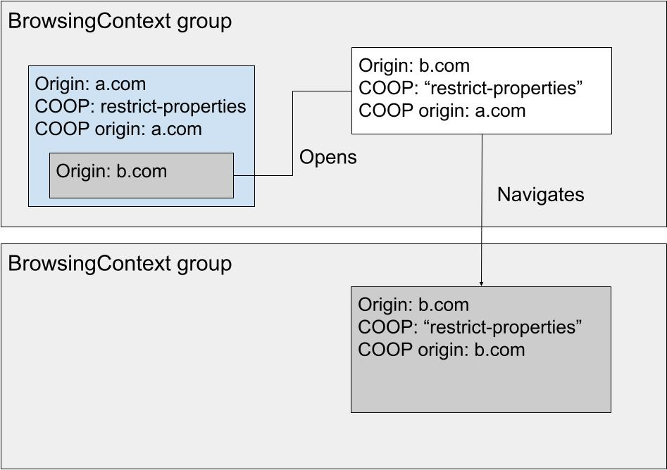

# Popups from cross-origin iframes in COOP: restrict-properties pages

## Important if you're reading only this doc
The latest plan for COOP: restrict-properties is to use a superset of BrowsingContext groups, COOP groups, and to have a map of { COOP: rp, top-level origin, crossOriginIsolated } to BrowsingContext groups in those, similar to the AgentCluster map in BrowsingContext groups themselves.

## Proposal
We want the initial document of popups opened from iframes cross-origin to their top-level document to inherit COOP. If we don't, we cannot support COOP: restrict-properties, for which we cannot simply set noopener.

We do not currently inherit COOP, because it would mix the origin, inherited from the iframe, with the COOP value, inherited from the top-level document. 

  
_By simply inheriting, we break COOP. In this example, everything lives in the same process, which should never be allowed._

 

Our proposal is to supplement the COOP structure with the origin that initially set it. This way we prevent the mix-up of origins and COOP value. The COOP origin is used exclusively by the COOP algorithm.

  
_By supplementing COOP with the setting origin, we solve the confusion. In this example, we have two distinct BrowsingContext groups._

## Potential alternatives
* We could query the opener's top-level document origin directly when doing the first navigation. However this could end up being complicated, if popups are nested for example. This would require a more complex algorithm.

* We could use noopener for cross-origin iframes, but that would significantly reduce the usefulness of the feature, because it is expected that a lot, if not the majority of popup flows are actually started from such iframes.

* We could always put the initial empty document in its own BrowsingContext group, within the same COOP group. This is not realistic for the following reasons:
    * Window.open returns synchronously. If we need to wait for potentially another process to be started, we end up with an empty WindowProxy, potentially for hundreds of ms. This would force us to talk about processes in the HTML spec.
    * We would lose synchronous scripting between the iframe and the newly opened document, this probably needs more metrics to know if it is acceptable.

## Additional considerations

### COEP and crossOriginIsolated
COOP and COEP interactions are important because of cross-origin isolation. COEP is inherited directly from the opener. Cross-origin isolation is a state that lives at the BrowsingContext group level.

  
_COEP gets passed to the initial empty document because the iframe set it._

In the example above, we have multiple top-level origin documents in a BrowsingContext group that is crossOriginIsolated. We believe this is fine:
* Anything that the iframe does is readable by a.com. This is fine because b.com agreed to that by setting COEP. The fresh popup is required to be in-process, and anything done in there can be read by a.com. A.com cannot get any extra information, because the top-level frame has the same restriction as the iframe. It has COEP so it cannot do new embedding, it has the same origin so it cannot do extra fetch, etc.
* In the other direction, b.com can read a.com if the Permissions-Policy is delegated to the iframe. No inheritance mechanism is planned for opened popups. For this reason we explicitely disable crossOriginIsolated permission on all freshly opened popups.

COOP invariants about top-level origins become invariants about top-level COOP origins. The only case where a page can have a COOP origin not equal to its actual origin is the initial empty document. No capability

 

Finally, about a potentially problematic situation:

  
_COEP gets inherited to the top-level document although its document top-level COEP did not set it. In that case, we would end up with a crossOriginIsolated mismatch._

We have a couple of options:
* Modify the COEP inheritance rule to something like: "Inherit only if all the ancestors also set COEP." When COEP is set without COOP, there is no security implication. Sure the newly opened popup could itself embed non COEP opted-in pages, but wouldn't be able to use the same-process to abuse it. This is suggested one.
* We could also decide on crossOriginIsolated directly at response time, remove COOP+COEP as a value, and instead use the crossOriginIsolated value in the COOP algorithm. This makes inheriting COOP and COEP from different sources not grant crossOriginIsolated. This solution seems way to complicated to solve this particular problem.

### Origin and CSP
Because we're recording the origin along the COOP value, we need to decide what to do with sandboxing, which can make the origin opaque. The current spec mentions that we first compute the sandboxing flags, both inherited and set via CSP, and then if COOP is also set we go to an error page. It is not clear if the whole process is to be applied to redirects. My understanding is that COOP is enforced but CSP is not, creating a discrepency.

A couple of possibilities, undecided yet:
* Dicard non inherited CSP sandboxing for the purpose of computing COOP origins. We simply get the inherited flags, if they exist we go to an error page. We then record the pre-CSP origin. This makes things consistent in all cases, including for redirects.
* We include all sandboxing at all stages. This involve having to parse CSP during redirects, but is similarly consistent.
* We disregard CSP during redirects, as is done today (at least in Chrome), but enforce all CSP at commit time. This means that a.com+COOP+CSP -> a.com+COOP -redirects-> a.com+COOP+CSP does not trigger a BrowsingContext group swap. This seems like a very niche case that might not be worth fixing right now.
