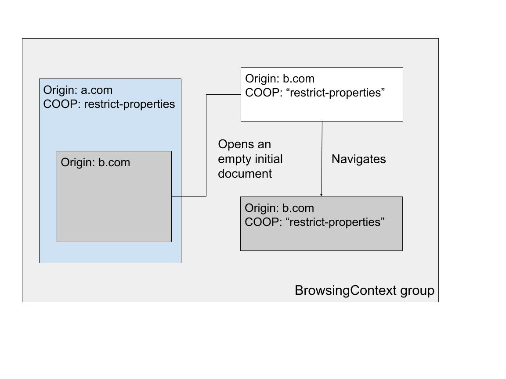
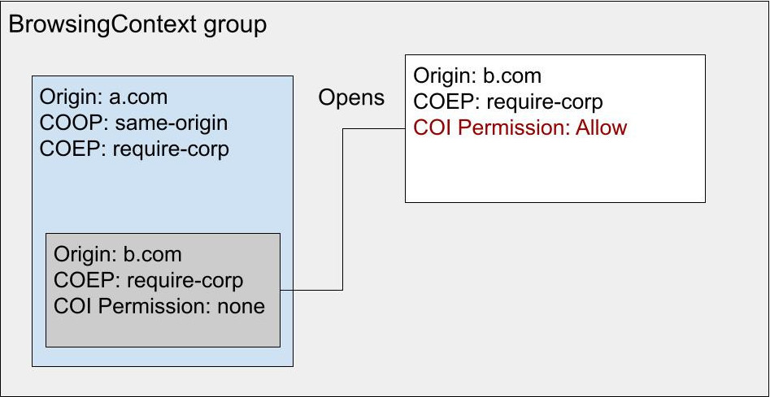
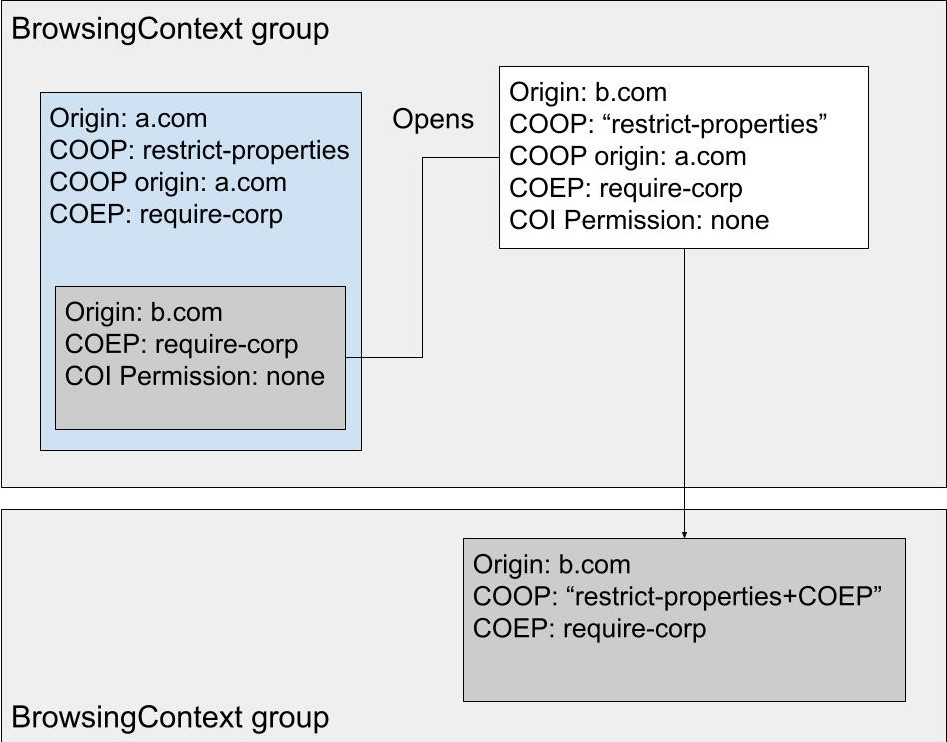
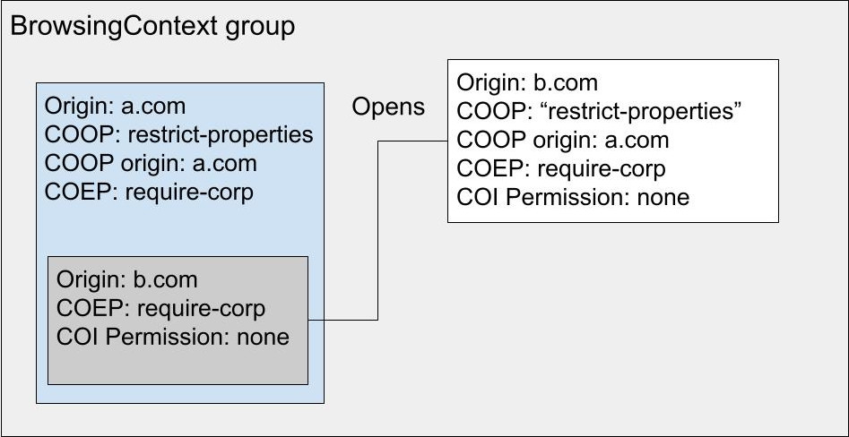
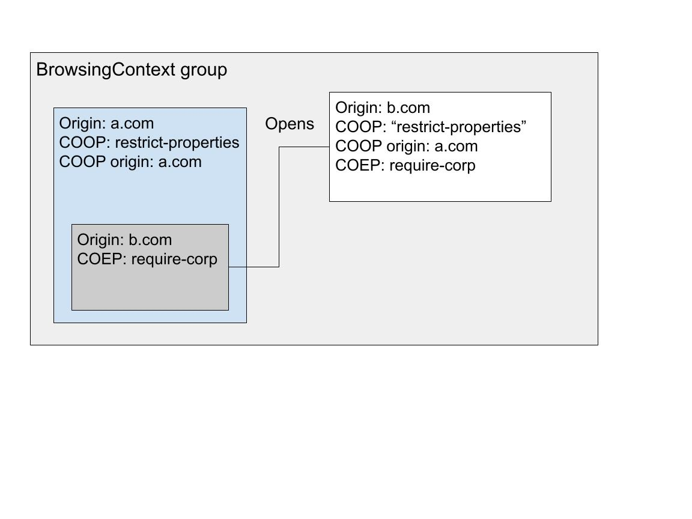

# Popups from cross-origin iframes in COOP: restrict-properties pages

## Important if you're reading only this doc
The latest plan for COOP: restrict-properties is to use a superset of BrowsingContext groups, COOP groups, and to have a map of { COOP: rp, top-level origin, crossOriginIsolated } to BrowsingContext groups in those, similar to the AgentCluster map in BrowsingContext groups themselves.

## Requirements
For COOP: restrict-properties to work, we need:
* To be able to work with cross-origin iframes opening popups. These are common in the flow we're trying to address. 
* To use the standard COOP comparison rules for freshly opened popups on their first navigation. Currently we do not inherit COOP for fresh popups opened by cross-origin iframes. So it is always `unsafe-none` to X. This works for current COOP values:
  * `same-origin-allow-popups` behaves like `unsafe-none` with freshly opened popups.
  * `same-origin` opens such popups with no-opener.
  * It does not work with COOP: `restrict-properties` because we need to swap against `unsafe-none`.

 

We do not currently inherit COOP or use noopener for two reasons:
* It would mix the origin, inherited from the iframe, with the COOP value, inherited from the top-level document.
* An initial empty documents from a different origin in the same browsing context group, if crossOriginIsolated, could read the top-level origin, bypassing the PermissionsPolicy that might have been set on the iframe.

  
_By simply inheriting, we break COOP. In this example, everything lives in the same process, which should never be allowed._

 

  
_By not using noopener, we've allowed the iframe to exploit crossOriginIsolated APIs, bypassing the PermissionsPolicy set by the embedder._

## Proposal

Our proposal is to supplement the COOP structure with the origin that initially set it. This way we prevent the mix-up of origins and COOP value. The COOP origin is used exclusively by the COOP algorithm. Initial empty documents that do not have matching origin and COOP origin cannot use crossOriginIsolated APIs.

  
_By supplementing COOP with the setting origin, we are able to correctly separate the two end pages in two distinct browsing context groups. The initial empty document still lives in the opener browsing context group but might not use CrossOriginIsolated APIs._

 

## Potential alternatives
* We could query the opener's top-level document origin directly when doing the first navigation. However this could end up being complicated, if popups are nested for example. This would require a more complex algorithm.

* We could use noopener for cross-origin iframes, but that would significantly reduce the usefulness of the feature, because it is expected that a lot, if not the majority of popup flows are actually started from such iframes.

* We could always put the initial empty document in its own BrowsingContext group, within the same COOP group. This is not realistic for the following reasons:
    * Window.open returns synchronously. If we need to wait for potentially another process to be started, we end up with an empty WindowProxy, potentially for hundreds of ms. This would force us to talk about processes in the HTML spec.
    * We would lose synchronous scripting between the iframe and the newly opened document, this probably needs more metrics to know if it is acceptable.

## Details about crossOriginIsolated origin mix
Some more details about the crossOriginIsolated restriction for pages with mismatched origins and COOP origins:

  
_COOP is inherited from the top-level opener browsing context. COEP gets passed to the initial empty document because the iframe set it. crossOriginIsolated permission is none because COOP origin and origin do not match._

 

In the example above, we have multiple top-level origin documents in a BrowsingContext group that is crossOriginIsolated. We believe this is fine:
* Anything that the iframe does is readable by a.com. This is fine because b.com agreed to that by setting COEP. The fresh popup is required to be in-process, and anything done in there can be read by a.com. A.com cannot get any extra information, because the top-level frame behaves like the iframe. It has COEP so it cannot do new embedding, it has the same origin so it cannot do extra fetches, etc.
* In the other direction, b.com can read a.com if the Permissions-Policy is delegated to the iframe. No inheritance mechanism is planned for opened popups. For this reason we explicitely disable crossOriginIsolated permission on all freshly opened popups.
* COOP invariants about top-level origins become invariants about top-level COOP origins. The only case where a page can have a COOP origin not equal to its actual origin is the initial empty document.

 

Finally, a note about the following situation:

  
_COEP gets inherited to the popup although only the iframe set it and its top-level document did not. The iframe is NOT crossOriginIsolated._

 

We've simplified the COOP value in the drawings. In reality it is augmented with COEP when it is received from the network, and used alone in the COOP algorithm. In the above picture it still works as intended, because we're inheriting COOP: "restrict-properties" and not "restrict-properties+COEP".

## Origin and CSP
Because we're recording the origin along the COOP value, we need to decide what to do with sandboxing, which can make the origin opaque. The current spec mentions that we first compute the sandboxing flags, both inherited and set via CSP, and then if COOP is also set we go to an error page. It is not clear if the whole process is to be applied to redirects. My understanding is that COOP is enforced but CSP is not, creating a discrepency.

A couple of possibilities, undecided yet:
* Dicard non inherited CSP sandboxing for the purpose of computing COOP origins. We simply get the inherited flags, if they exist we go to an error page. We then record the pre-CSP origin. This makes things consistent in all cases, including for redirects.
* We include all sandboxing at all stages. This involve having to parse CSP during redirects, but is similarly consistent.
* We disregard CSP during redirects, as is done today (at least in Chrome), but enforce all CSP at commit time. This means that a.com+COOP+CSP -> a.com+COOP -redirects-> a.com+COOP+CSP does not trigger a BrowsingContext group swap. This seems like a very niche case that might not be worth fixing right now.
