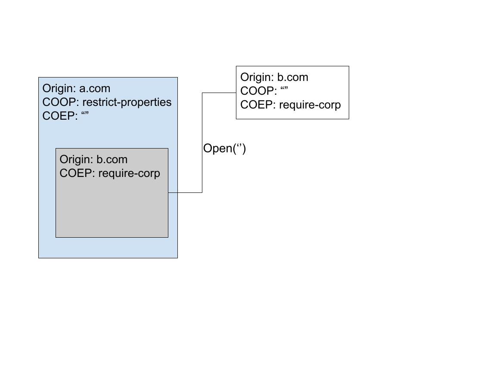

# Cross-origin iframe popups in COOP: restrict-properties pages

## Initial empty document inheritance
There exist inheritance rules to define what security properties a freshly opened popup with no URL inherits. This is important for two reasons:
- A document created in this state, for example by doing a simple `window.open()` is scriptable by the page that opened it.
- Opening to a specific url is actually done in two steps. First opening an empty new popup, and then navigating it to an actual document.

For our topic, we're particularly interested in the way the origin, COOP and COEP are inherited.

# Opening from a same-origin iframe

# Opening from a cross-origin iframe

  
_The_