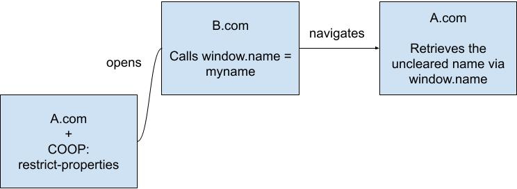
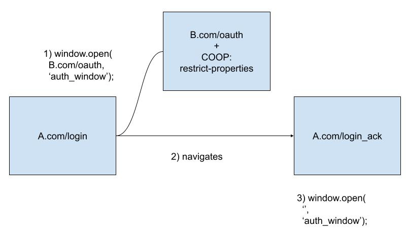
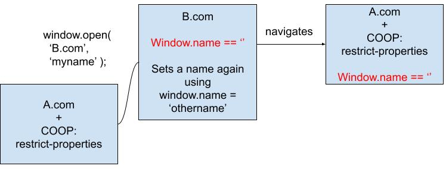
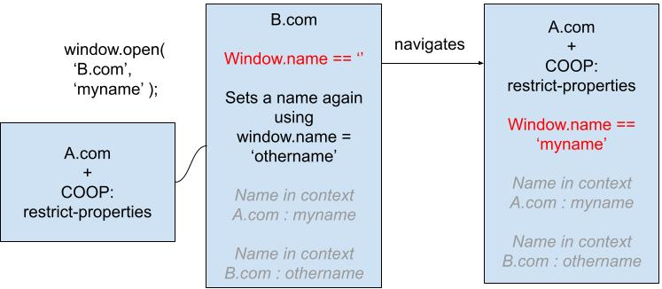

# Window.name across BrowsingContext groups

## Important if you're reading only this doc
The latest plan for COOP: restrict-properties is to use a superset of BrowsingContext groups, COOP groups, and to have a map of { COOP: rp, top-level origin, crossOriginIsolated } to browsing context groups in those, similar to the AgentCluster map in BrowsingContext groups themselves.

## Why it matters

`name` is a same-origin property of the Window object. While it cannot ever be set or read directly by windows in other browsing context groups, it has the particularity of being sticky, even during cross-browsing context group navigations.

  
_Because the property is linked to the window and not the document, this can be a cross-site leak vector. In this example, the original A.com page, a potentially crossOriginIsolated page was able to read the window's name._

It is commonly used for named targetting, which is specifying a string as the "target" of an anchor tag, a `window.open()` parameter, etc. to navigate that target, or retrieve a window handle to it. This also has its own problems, because we do not want a regular page to be able to navigate a crossOriginIsolated page ever. Named targeting resulting in navigations are therefore completely prohibited between browsing context groups. On the other hand, there is no reason why we should not allow for window handle retrieval.

  
_After a same-origin navigation of the opener, it tries to retrieve a handle to the popup previously opened._

## Short term mitigation

A simple solution to this problem is to clear the window's name during a navigation to a different browsing context group in the same COOP group.

  
_In that case, the popup name is cleared when navigating to B.com. When it navigates back to A.com, the name is cleared again._

This interacts with named targetting, as the name is cleared, targetting cannot resolve between the main page and the popup after it is navigated. The popup has to manually update its name to something known by the main page.

## Long term mitigation

We would prefer a solution that does not interact with named targetting, and makes it easier and more robust for web developers to use named targeting with multiple browsing context groups. An option would be to move from a single name model to a multiple name model. In that case, each browsing context would have a name per browsing context group that wants to refer to it.

  
_Instead of clearing window.name, we link it to the browsing context group that set it. Named targeting resolves if a page from A.com's browsing context group targets the popup using 'myname'. B.com's browsing context group on the other hand still sees the name as empty. After it sets a name of its own, it can be used in B.com's browsing context without overriding A.com's set name._

With this solution, we preserve legitimate use cases, and only need to manually block named targetting across browsing context groups whch result in a navigation. Note that this mechanism could also be used for browsing context groups swaps to another COOP group, and to help restore names on back navigation for example.
